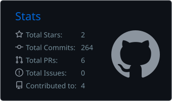
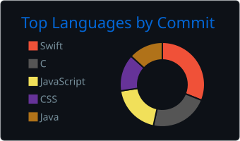

<h1 align="center">Hi, I'm Vineet Parmar 👋</h1>

  <b>Software Developer at JPMorganChase</b> &nbsp;·&nbsp; Computer Engineering, SPIT Mumbai

  
  
  
  

---

### About me

I'm a software developer at **JPMorganChase** (since July 2025), building software for one of the world's largest financial institutions. I studied Computer Engineering at Sardar Patel Institute of Technology, Mumbai, and I enjoy working across the stack: from REST APIs and databases to polished front ends and, lately, native macOS apps.

- 💼 Software Developer @ JPMorganChase (Jul 2025 – present)
- 🍎 Currently learning Swift and SwiftUI by building **[Notch](https://github.com/vinzi0812/notch)**, a Dynamic Island-style app for the MacBook notch
- 🌱 Interested in backend systems, clean architecture and good developer tooling
- 📫 Best way to reach me: [LinkedIn](https://www.linkedin.com/in/vineetjparmar/) or [email](mailto:vineetjparmar@gmail.com)

---

### Tech stack

**Languages**

  

**Backend & Databases**

  

**Frontend**

  

**Tools & Cloud**

  

---

### Featured projects

| Project | What it is | Built with |
| --- | --- | --- |
| [**Notch**](https://github.com/vinzi0812/notch) | Dynamic Island-style macOS app: battery and charging activity, Pomodoro timer, next calendar event, file shelf and Now Playing controls | Swift · SwiftUI · AppKit |
| [**NoteVault**](https://github.com/vinzi0812/NoteVault) | Collaborative platform for students to share notes, question papers and resources, with faculty review | Python · Django |
| [**Dhulikona**](https://github.com/vinzi0812/Dhulikona) | JPMC Code for Good '23 finalist: helps villagers report water-supply issues and tracks pump operation and water quality | Web · OTP auth |
| [**SPIT TPO Website**](https://github.com/vinzi0812/SPIT-TPO-Website) | Portal for the Training & Placement Office at SPIT | React · Chakra UI |

---

### Experience & highlights

- **Software Developer, JPMorganChase** (Jul 2025 – present)
- **Full Stack Web Developer Intern, SPTBI** (Jul 2023): rebuilt the incubator's website
- **Finalist, JPMorganChase Code for Good 2023**
- Built *Synopify*, an AI answer generator (2023)
- Collaborated on the event website for *Code Red*, Oculus Coding League (2022–23)

---

### GitHub stats

  
  

  

  

---

  

